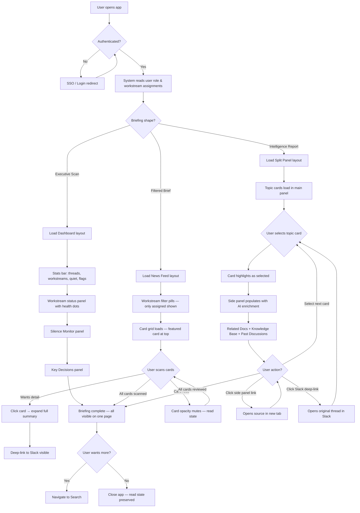
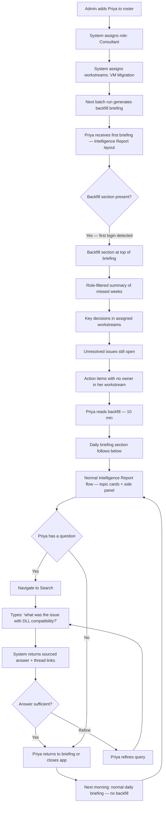
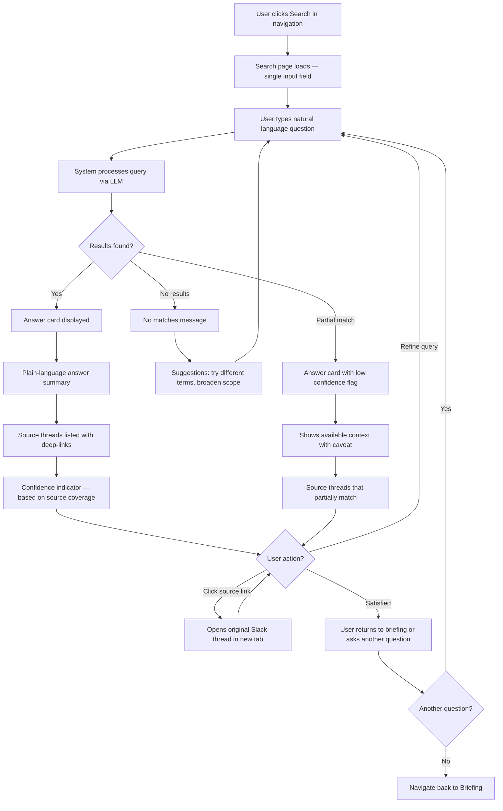
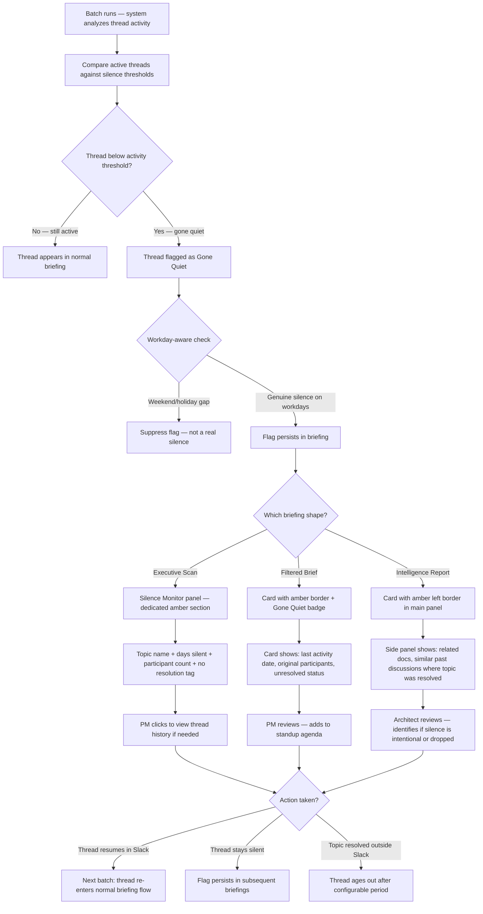

---
stepsCompleted:
  - "step-01-init"
  - "step-02-discovery"
  - "step-03-core-experience"
  - "step-04-emotional-response"
  - "step-05-inspiration"
  - "step-06-design-system"
  - "step-07-defining-experience"
  - "step-08-visual-foundation"
  - "step-09-design-directions"
  - "step-10-user-journeys"
  - "step-11-component-strategy"
  - "step-12-ux-patterns"
  - "step-13-responsive-accessibility"
  - "step-14-complete"
inputDocuments:
  - "_bmad-output/planning-artifacts/prd.md"
  - "_bmad-output/planning-artifacts/product-brief-slack_thread_manager.md"
  - "_bmad-output/planning-artifacts/prfaq-slack_thread_manager.md"
  - "_bmad-output/planning-artifacts/prfaq-slack_thread_manager-distillate.md"
  - "_bmad-output/brainstorming/brainstorming-session-2026-05-05-1219.md"
---

# UX Design Specification - Slack Thread Manager

**Author:** Shebi
**Date:** 2026-05-06

---

<!-- UX design content will be appended sequentially through collaborative workflow steps -->

## Executive Summary

### Project Vision

The Slack Thread Manager dashboard is a consumption-first, text-centric internal tool for ~30 Red Hat EOS team members. Users read briefings, search for context, and scan for risks — they don't create content. The UX promise: every team member starts their day with a personalized intelligence briefing that replaces Slack scrolling, with zero onboarding and zero behavior change.

### Target Users

Five personas with distinct information needs served through role-based views:

- **Architect (Raj)** — High technical literacy. Needs dense, linked, cross-workstream technical patterns. Scans for precedents and conflicts. MVP persona.
- **PM (Dana)** — Medium technical literacy. Needs plain-language summaries, orphaned action lists, and silence flags. Action-oriented scanning. MVP persona.
- **New Consultant (Priya)** — High technical literacy. Needs backfill onboarding view and fast natural language search. Time-travel context recovery.
- **Sales (Marcus)** — Low technical literacy. Needs plain-language search with project health signals. Minimal interaction surface.
- **Admin (Shebi)** — High technical literacy. Needs efficient staging review, roster management, and system configuration. Sole operator — workflow speed matters.

### Key Design Challenges

1. **Multi-persona role switching** — Five distinct views from shared data without feeling like a generic dashboard with filters
2. **Briefing information hierarchy** — Dense enough for power users, scannable enough for 10-minute morning reads, with competing attention demands (thread links, flags, cross-workstream markers, orphaned actions)
3. **Admin staging bottleneck** — Anonymization review is a gating step; if the review UX is slow, the entire briefing pipeline stalls

### Design Opportunities

1. **"Start your day here" ritual** — The briefing view as a morning-radar experience that becomes indispensable within the first week
2. **Source-linking as trust architecture** — One-click verification of every LLM-generated claim builds compound trust over time
3. **Zero-onboarding as design constraint** — The Silent Observer principle simplifies design: if the interface needs explanation, it's wrong

## Core User Experience

### Primary Job-to-be-Done

**"When I sit down to work, I need to know what happened while I was away that affects my work — without scrolling Slack to find it."**

Secondary: "When I have a specific question about a past discussion, I need a sourced answer faster than Slack search can give me."

### Defining Experience

The Slack Thread Manager is an always-available reference tool, not a push system. Users access it when they need it via a persistent URL — no notifications, no reminders, no delivery mechanism. The core interaction pattern is **scan → identify → act elsewhere**: users scan briefings or search results, identify items that need attention, click through to the source of truth (Slack thread, Google Docs link), and take action there. The dashboard is a radar and a launchpad — work happens in Slack.

### Platform Strategy

- **Web SPA** — single URL, always available, bookmarkable
- **Desktop-first** — mouse/keyboard interaction, minimum 1024px viewport
- **No offline requirement** — users access when connected, during working hours
- **No push notifications or delivery mechanism** — users come to the dashboard on their own schedule
- **Source-of-truth linking** — every actionable item links out to Slack or Google Docs where users take action

### Effortless Interactions

- **Briefing scanning** — open the dashboard, immediately see what's new and relevant to your role. No navigation, no configuration, no "catching up" steps.
- **Role-differentiated scan surfaces** — Architects see a pattern rail (cross-workstream connections, technical conflicts, dependency signals). PMs see an action queue (orphaned items, unanswered questions, "Gone Quiet" flags). Same data, different focal length — not a skin on the same wall of text.
- **Source jumping** — one click from any briefing item or search result to the original Slack thread. The link must open directly to the right message, not just the channel.
- **In-scan provenance cues** — key context visible without leaving the briefing: source thread timestamp, participant count, channel name. Verification starts before the click, not after.
- **Re-entry (today's briefing)** — a user who leaves mid-briefing to act in Slack can return and resume scanning today's briefing. Visual indicators distinguish viewed from not-yet-viewed items within the current briefing.
- **Cold return (multi-day absence)** — a user returning after days or vacation sees a "since your last visit" summary highlighting what changed, rather than a stale or overwhelming backlog. The system tracks last-visited date per user.
- **Search resolution** — type a question, get a sourced answer, click through. Three interactions maximum from question to source thread. Promise is orientation in under 5 seconds (you know where to look next), not necessarily a complete synthesized answer.
- **Role-based default view** — the dashboard opens to the right view for your role automatically. No manual switching needed on initial load.

### Critical Success Moments

1. **First briefing scan** — The user opens the dashboard, sees their role-filtered briefing, and within 60 seconds identifies something they would have missed in Slack. For Architects: a cross-workstream pattern or conflict. For PMs: an orphaned action or silence flag. This is the moment that converts them into a repeat visitor.
2. **Source verification** — A user reads an LLM-generated summary, clicks through to the original thread, and confirms the summary was accurate. This builds the trust that sustains long-term use.
3. **Trust recovery (graceful failure)** — A user finds a summary that's inaccurate or thin, and the UI makes this obvious rather than hiding it. The source link is always one click away for correction. Confidence cues (thread age, participant count, channel context) help users calibrate when to trust summaries at face value vs. when to verify. The system never punishes curiosity — checking the source is encouraged, not a failure state.
4. **Search payoff** — A user types a natural language question ("what was decided about storage classes?"), gets oriented to the right threads in under 5 seconds, and stops scrolling Slack.
5. **"Gone Quiet" catch** — Dana (PM) glances at the silence dashboard, spots a topic that dropped off, and prevents a real project oversight. The framing is signal about the thread, not judgment about people — language and visual weight avoid surveillance or scorekeeping tone.

### Experience Principles

1. **Radar, not destination** — The dashboard exists to get users oriented and send them to where work happens. Minimize time in the tool, maximize time acting on insights.
2. **Scan-depth on demand** — Show headlines first, details on expansion. Users control how deep they go. Architects and PMs have different scan gradients: pattern density vs. action urgency.
3. **Every claim is verifiable** — No summary exists without a source link. In-scan provenance cues reduce verification round-trips.
4. **Role is the default lens** — The system knows who you are. The right view loads automatically. MVP designs for Architect and PM defaults only — other roles must not be blocked but are not optimized in V1.
5. **Zero ceremony** — No splash screens, no onboarding wizards, no "what's new" modals. Open the URL, see your briefing. Every visit starts at value.
6. **Trust is earned through rhythm** — Early visits teach reliability through easy verification. As users confirm accuracy over repeated visits, trust accelerates and verification becomes occasional rather than constant. The UX supports both modes: skeptical newcomer and confident regular.

## Desired Emotional Response

### Primary Emotional Goals

**"I have control because I can see what's happening."**

The primary emotion is **strategic confidence** — the feeling that comes from having a clear picture of project momentum, deviations, and escalation needs without having to reconstruct it manually. This isn't the satisfaction of completing a task; it's the calm that comes from knowing where things stand.

| Persona | Target Feeling | What Triggers It |
|---------|---------------|-----------------|
| Architect (Raj) | "I see where we're drifting and who I need to loop in" | Cross-workstream deviations, escalation signals, directional conflicts surfaced in briefing |
| PM (Dana) | "Nothing is falling through the cracks on my watch" | Orphaned actions visible, silence flags present, action queue clear |
| New Consultant (Priya) | "I'm not starting from zero — I already know what matters" | Backfill briefing covers weeks of context in minutes |
| Admin (Shebi) | "The system is running clean and the data is safe" | Staging pipeline clear, anonymization confident, no leaks |

### Emotional Journey

**First visit:** Curiosity → Recognition ("this is showing me things I actually missed") → Relief ("I don't have to scroll Slack anymore")

**Regular use:** Routine confidence → Occasional sharp attention when a deviation or silence flag appears → Quick resolution via source link → Return to baseline confidence

**Inaccurate summary encountered:** Brief skepticism → Easy verification via source link → "The safety net works" → Trust preserved. The target emotion is calm confidence in the fallback, not frustration with the tool. Tolerance for imperfection is high as long as verification is effortless.

**Multi-day absence return:** Momentary overwhelm ("what did I miss?") → Orientation via "since your last visit" summary → Rapid catch-up → Restored confidence

### Micro-Emotions

**Prioritized for this product:**

- **Confidence over confusion** — The most critical axis. Every screen must immediately communicate "here's what you need to know" without requiring the user to figure out where to look.
- **Trust over skepticism** — LLM-generated content starts at a trust deficit. Source links, provenance cues, and consistent accuracy over time shift the needle. Design must make trust-building frictionless.
- **Calm alertness over anxiety** — Deviations, orphaned actions, and silence flags must capture attention without creating noise or dread. Informational tone, not alarm tone. A weather radar, not a fire alarm.

**Not prioritized (by design):**

- Delight / surprise — This is a utility tool. Reliability is the delight.
- Excitement — Steady confidence beats emotional spikes.
- Social belonging — This is a solo-use tool; team dynamics happen in Slack.

### Design Implications

| Emotional Goal | UX Design Approach |
|---------------|-------------------|
| Strategic confidence | Information hierarchy that surfaces deviations and escalation needs above routine updates. Architects and PMs see what requires action first, context second. |
| Calm alertness | "Gone Quiet" and deviation signals use distinct but non-alarming visual treatment — color accent, not red alert. Prominent placement, neutral language. Captures attention on open, not through urgency cues. |
| Trust through transparency | Every summary shows provenance cues inline (timestamp, channel, participant count). Source links are visually prominent, not buried. Verification is one click, not a workflow. |
| Effortless recovery | Inaccurate or thin content shows the source link more prominently, not less. The UI never hides uncertainty — it acknowledges it and provides the escape hatch. |
| Cold-return orientation | "Since your last visit" framing reduces overwhelm for irregular visitors. Time-anchored rather than volume-anchored — "3 days of activity" not "47 new items." |

### Emotional Design Principles

1. **Confidence is the product** — If users don't feel in control of what's happening in the project, the tool has failed regardless of feature completeness.
2. **Attention without anxiety** — Signals that capture attention (deviations, silence, escalation needs) must feel informational, never punitive or alarming. The tone is "here's something worth knowing" not "something is wrong."
3. **Trust compounds silently** — Don't celebrate accuracy. Let users discover it through repeated verification. Trust built through consistent experience is more durable than trust claimed through messaging.
4. **Imperfection is honest** — When content is uncertain or thin, the UI says so. Hiding limitations erodes trust faster than admitting them.

## UX Pattern Analysis & Inspiration

### Inspiring Products Analysis

**Google News / Discover** — Personalized daily content surface
- Headlines-first design — scan 20+ items in 2 minutes by reading titles, selectively expand for more
- Content organized by topic clusters, not chronological feed — related stories grouped together
- Personalization is invisible — no settings, no configuration, it just shows relevant content based on who you are
- One tap to full article at the original source — Google News is a launchpad, not a destination
- Cards with inline metadata (source, time, topic label) give enough context to decide "read or skip" without clicking
- **Relevance:** This is the closest analogue to the briefing experience. The morning briefing should feel like opening Google News — immediately scannable, topic-clustered, personalized without configuration, and every item links to the source.

**Grafana Dashboards** — Monitoring and anomaly detection
- At-a-glance status panels with color-coded severity levels — designed for quick visual scanning
- Anomaly detection: deviation from baseline surfaced visually without alarm — you notice what's different, not what's normal
- Time-range controls: "show me what changed in the last 3 days" — natural for cold returns
- Drill-down from summary panels to detailed views — progressive depth
- Panels are composable and role-configurable — different dashboards for different audiences from the same data
- **Relevance:** The "Gone Quiet" silence dashboard and deviation detection. The team already understands Grafana's visual language — color accents for attention, panels for at-a-glance scanning, drill-down for detail. This is familiar territory.

### Transferable UX Patterns

**Navigation Patterns:**
- **Topic clustering over chronological feed** (Google News) — briefing groups items by workstream or topic, not by time. Cross-workstream items get their own highlighted cluster. Users scan by topic relevance, not recency.
- **Card-based layout with inline metadata** (Google News) — each briefing item is a self-contained card showing headline, source channel, timestamp, participant count, and flag type. Enough to decide "expand or skip" without clicking.

**Interaction Patterns:**
- **Headlines-first progressive disclosure** (Google News) — headline → summary → full source. Users control depth. Never front-load the full content. The scan layer is all headlines; expansion is optional.
- **One-click source jumping** (Google News) — every item links directly to the original thread. The link is the primary action, not a secondary footnote.
- **Persistent viewed/not-viewed state** — items the user has already scanned are visually dimmed. Supports re-entry without losing place in today's briefing.

**Visual Patterns:**
- **Color accent for signals, not alarms** (Grafana) — "Gone Quiet" flags, orphaned actions, and cross-workstream markers use distinct color accents (amber, not red) that capture attention without triggering urgency anxiety. The team already reads Grafana color language.
- **Panel-based monitoring layout** (Grafana) — the silence dashboard uses composable panels: topics by workstream, silence duration bars, last-activity timestamps. Familiar visual grammar for anyone who's used Grafana.
- **Time-anchored framing for cold return** (Grafana) — "since your last visit" or "last 3 days" rather than raw item counts. Grafana's time-range selector pattern adapted to briefing context.

### Anti-Patterns to Avoid

- **Slack's own search** — keyword-based, no semantic understanding, requires knowing which channel to search, returns raw messages without synthesis. This is the exact pain point the product solves — don't replicate it.
- **Email inbox overload** — unread counts that climb into the hundreds create guilt and avoidance. Never show raw item counts. Use time-anchored framing instead.
- **Alert fatigue dashboards** — red/yellow/green severity grids that trigger anxiety and get ignored over time. "Gone Quiet" stays informational, never surveillance-like.
- **Smartsheet-style density** — dense grids with too many columns, modes, and filter options. The dashboard should feel like reading a briefing, not operating a spreadsheet.
- **Onboarding wizards and tutorials** — zero-ceremony principle means no "welcome" modals, no feature tours, no tooltips. If the interface needs explanation, redesign it.

### Design Inspiration Strategy

**Adopt:**
- Google News' headlines-first card layout for briefing items — scannable, topic-clustered, with inline metadata
- Google News' invisible personalization — role determines the view, no user configuration
- Grafana's calm anomaly detection visual language for the silence dashboard — color accents, panel layout, time-range framing

**Adapt:**
- Google News' topic clustering → workstream-based briefing grouping with cross-workstream highlights elevated above routine items
- Grafana's time-range controls → "since your last visit" cold-return orientation for irregular visitors
- Grafana's composable panels → role-specific dashboard configurations (Architect pattern rail vs. PM action queue)

**Avoid:**
- Slack search's raw keyword approach — search must be semantic and synthesized
- Email-style unread counts — use time-anchored framing
- Grafana-style alert severity grids — use calm color accents, not red/amber/green traffic lights
- Smartsheet-level complexity — briefing should feel like reading, not operating

## Design System Foundation

### Design System Choice

**Shadcn/ui + Tailwind CSS** — a composable component collection built on Radix UI primitives with Tailwind CSS utility-first styling.

### Rationale for Selection

| Factor | Assessment |
|--------|-----------|
| AI-agent compatibility | Strongest option — Tailwind and Shadcn are the most well-represented modern UI patterns in LLM training data. Agents generate reliable, idiomatic code. |
| Development speed | High — pre-built components for cards, tables, dialogs, forms, navigation, and data display. Covers briefing cards, admin panels, and search UI out of the box. |
| Layout flexibility | Maximum — utility-first CSS and composable primitives allow custom layouts (Google News-style briefing cards, Grafana-style monitoring panels) without fighting the framework. |
| Information density | Strong — Tailwind's spacing and typography utilities make it easy to achieve dense, scannable layouts without custom CSS. |
| Accessibility | Built-in via Radix UI primitives — keyboard navigation, ARIA attributes, and focus management handled at the component level. Supports post-V1 accessibility improvements. |
| Maintenance | Low overhead — components are owned source code, not black-box dependencies. Updates are opt-in. No breaking changes from upstream library releases. |
| Team context | Solo developer + AI agents. No design team to maintain Figma-to-code pipeline. Shadcn's code-first approach eliminates design tool dependencies. |

### Implementation Approach

- Initialize with Shadcn CLI to scaffold base components (Card, Button, Input, Table, Dialog, Tabs, Badge, Separator)
- Configure Tailwind theme tokens for the project's color palette, typography scale, and spacing rhythm
- Build custom composite components from Shadcn primitives:
  - **BriefingCard** — headline, summary, provenance metadata, source link, flag badges
  - **SilencePanel** — Grafana-inspired monitoring panel for "Gone Quiet" topics
  - **StagingReviewItem** — anonymization review with approve/reject actions
  - **SearchResult** — answer with source links and confidence cues
- Use Tailwind's dark mode support for potential future dark theme (not V1, but zero-cost to preserve the option)

### Customization Strategy

**Design Tokens (Tailwind theme):**
- **Color palette:** Neutral base (slate/gray) for text-heavy readability. Amber accent for attention signals ("Gone Quiet," orphaned actions, cross-workstream flags). Blue accent for source links and interactive elements. No red in the default palette — aligns with "calm alertness" emotional goal.
- **Typography:** System font stack for fast rendering. Two scale levels: body text for content, small text for provenance metadata (timestamps, channel names, participant counts).
- **Spacing:** Tight but readable — optimized for information density on desktop viewports. Card padding and list spacing tuned for scan speed.
- **Component-level customization:** Shadcn components are plain source code — agents can modify any component directly without abstraction barriers.

## 2. Core User Experience

### 2.1 Defining Experience

**"Open your personalized briefing and instantly see what matters to your role — with an AI research assistant ready at your side."**

The core interaction is **role-aware briefing consumption with optional AI-enriched context**. Every user opens the same app but sees a different product shaped by their role and workstream assignments. The system reads Slack, filters by relevance, and — for deep-view roles — proactively researches related documentation so the user doesn't have to.

Three briefing shapes serve distinct needs:

| Briefing Shape | Roles | Scope | Depth | AI Enrichment |
|----------------|-------|-------|-------|---------------|
| **Executive Scan** | Program Manager, Engagement Lead, Sales | All workstreams | Headline status per workstream — what happened, what's at risk, what went quiet | None — aggregated summaries only |
| **Filtered Brief** | Project Managers | Assigned workstreams only | Summary cards with decisions, blockers, action items per topic | None — thread summaries sufficient |
| **Intelligence Report** | Lead Architect, Consultants | All or assigned workstreams | Full thread analysis with provenance, participant context, and timeline | Yes — side panel with proactive Knowledge Base, NotebookLM, and OpenShift doc references |

### 2.2 User Mental Model

**Current approach:** Scroll Slack channels, attend standups, ask colleagues "what did I miss?" Architects and consultants spend 30+ minutes reconstructing context from fragmented thread conversations.

**Mental model they bring:**
- Expect chronological ordering (Slack habit) — but topic clustering by workstream is what they actually need
- Expect to read everything (Slack scroll) — but role-filtered relevance means they only see what matters
- PMs expect a status dashboard (Smartsheet/Google Sheets mental model) — Executive Scan delivers this
- Architects and consultants expect a research tool (Google search mental model) — Intelligence Report with side panel delivers this

**Where confusion can occur:**
- First-time users may expect real-time Slack mirroring — need to set expectation that briefings are batch-generated daily snapshots
- Users may confuse AI-enriched side panel content with actual Slack thread content — visual separation between "source" and "enrichment" is critical
- Role assignment determines what you see — users who don't see certain workstreams need to understand this is by design, not a bug

### 2.3 Success Criteria

**Core experience succeeds when:**
- Executive Scan users finish their briefing in under 2 minutes and skip the morning standup feeling informed
- Filtered Brief users identify all blockers and decisions in their workstreams without opening Slack
- Intelligence Report users find the related documentation they would have spent 20 minutes searching for, already linked in the side panel
- Every user can deep-link to the original Slack thread with one click
- No user confuses AI-generated enrichment with original Slack content

**Success indicators:**
- Time from app open to "I know what I need to know": < 2 min (Executive), < 5 min (Filtered), < 10 min (Intelligence)
- Zero Slack scrolling required for daily awareness
- Side panel documentation links are relevant (not noise) — measured by click-through vs. dismiss
- "Gone Quiet" flags surface topics before the user notices the silence themselves

### 2.4 Novel vs. Established UX Patterns

**Pattern analysis:** Combination of established patterns with one novel element.

**Established patterns (no user education needed):**
- Role-based dashboard filtering — familiar from Jira, Smartsheet, Google Analytics
- Card-based content layout — familiar from Google News, Trello, email clients
- Deep-link to source — familiar from any notification system
- Search with natural language — familiar from Google, ChatGPT

**Novel pattern (requires clear affordance):**
- **AI Enrichment Side Panel** — proactively attaching Knowledge Base and documentation references alongside thread summaries. This is not a chatbot (no conversation). It's a research assistant that pre-fetches relevant context.
- **Familiar metaphor:** Footnotes in a research paper — the main text is the thread summary, the side panel is the bibliography the AI compiled for you.
- **Teaching approach:** First-time tooltip: "This panel shows related documentation our AI found for this topic. All links open in a new tab." No onboarding flow needed — the panel is self-explanatory if visually distinct.

### 2.5 Experience Mechanics

**1. Initiation — Opening the briefing:**
- User navigates to the app (bookmarked URL or direct link)
- System identifies user role and workstream assignments
- Briefing loads pre-generated content (batch-processed, not on-demand)
- First screen shows the briefing shape matching their role

**2. Interaction — Consuming the briefing:**

*Executive Scan:*
- Single scrollable page with one status card per workstream
- Each card: workstream name, headline summary, risk/silence flags, thread count
- Click any card to expand to thread-level summaries (progressive disclosure)

*Filtered Brief:*
- Only assigned workstreams visible
- Each workstream expands to show topic cards: decision summary, blocker flags, action items
- Each topic card has a deep-link icon to the original Slack thread

*Intelligence Report:*
- Full topic cards with detailed thread analysis in the main panel
- **Side panel** (right-hand, collapsible) activates when a topic card is selected
- Side panel sections: "Related Documentation" (OpenShift docs with deep links), "Knowledge Base" (NotebookLM entries), "Similar Past Discussions" (previously ingested threads on the same topic)
- All side panel items are deep links — clicking opens the source in a new tab
- Side panel content is visually distinct (different background, "AI-assisted" label) to prevent confusion with source content

**3. Feedback — Knowing it's working:**
- Briefing freshness timestamp: "Generated today at 06:00 AM from 8 threads across 4 workstreams"
- Read/unread state on topic cards — user sees their progress through the briefing
- "Gone Quiet" badges on workstreams with no activity in the configured threshold
- Side panel relevance cue: number of related docs found (e.g., "3 related docs")

**4. Completion — Knowing you're done:**
- All topic cards marked as read (visual state change: full opacity → muted)
- Optional: "Briefing complete" summary at bottom with key stats (threads covered, flags raised, docs linked)
- User closes the app or navigates to Search for ad-hoc queries
- Re-entry: returning later shows same briefing with read state preserved until next batch generates

## Visual Design Foundation

### Color System

**Brand source:** [Red Hat Design System](https://ux.redhat.com/tokens/color/) — official global color tokens.

**Primary palette:**

| Token | Hex | Application in Slack Thread Manager |
|-------|-----|--------------------------------------|
| Brand Red `red-50` | `#ee0000` | Logo mark, primary CTA buttons, app header accent |
| Brand Red Dark `red-60` | `#a60000` | Hover state for red elements |
| Brand Red Lightest `red-10` | `#fce3e3` | Danger/error alert backgrounds |

**Interactive colors (links and actions):**

| Token | Hex | Application |
|-------|-----|-------------|
| Blue `blue-50` | `#0066cc` | Primary links, deep-link icons to Slack threads, interactive elements |
| Blue `blue-70` | `#003366` | Link hover state |
| Blue `blue-10` | `#e0f0ff` | Info alert backgrounds, side panel enrichment background |
| Purple `purple-50` | `#5e40be` | Visited link state — user sees which briefing items they already opened |
| Purple `purple-30` | `#b6a6e9` | Visited link on dark backgrounds |

**Semantic status colors:**

| Semantic Role | Token | Hex | Application |
|---------------|-------|-----|-------------|
| Success | Green `green-50` | `#63993d` | Ingestion healthy, batch complete indicators |
| Success bg | Green `green-10` | `#e9f7df` | Success alert background |
| Warning | Yellow `yellow-30` | `#ffcc17` | "Gone Quiet" badges, attention flags |
| Warning bg | Yellow `yellow-10` | `#fff4cc` | Warning alert background |
| Danger | Red-Orange `red-orange-50` | `#f0561d` | System errors, failed ingestion |
| Info | Teal `teal-50` | `#37a3a3` | Default alerts, informational badges |
| Info bg | Teal `teal-10` | `#daf2f2` | Default alert background |

**Surface and text colors:**

| Token | Hex | Application |
|-------|-----|-------------|
| Canvas White | `#ffffff` | Primary background, main content area |
| Gray `gray-10` | `#f2f2f2` | Secondary surface (card backgrounds, side panel) |
| Gray `gray-20` | `#e0e0e0` | Borders, dividers |
| Gray `gray-30` | `#c7c7c7` | Subtle borders |
| Gray `gray-50` | `#707070` | Secondary text, metadata (timestamps, channel names) |
| Gray `gray-95` | `#151515` | Primary text (preferred over pure black per RH guidelines) |

**AI Enrichment Side Panel distinction:**
- Background: `blue-10` (`#e0f0ff`) — visually distinct from white content area
- "AI-assisted" label: `teal-50` (`#37a3a3`) badge
- Ensures users never confuse enrichment with source content

### Typography System

**Font families:** Red Hat's proprietary typefaces via Google Fonts or self-hosted.

| Role | Font | Weight | Usage |
|------|------|--------|-------|
| Headings (H1–H3) | Red Hat Display | Medium (500) | Page titles, section headers, briefing card headlines |
| Body text | Red Hat Text | Regular (400) | Thread summaries, briefing content, descriptions |
| Metadata/labels | Red Hat Text | Regular (400), smaller size | Timestamps, channel names, participant counts, badges |
| Code/technical | Red Hat Mono | Regular (400) | Log excerpts, technical references in enrichment panel |

**Type scale (base: 16px / 1rem):**

| Level | Size | Line Height | Usage |
|-------|------|-------------|-------|
| H1 | 2rem (32px) | 1.3 | Page titles ("Daily Briefing — May 6") |
| H2 | 1.5rem (24px) | 1.3 | Section headers (workstream names) |
| H3 | 1.25rem (20px) | 1.3 | Card titles (topic headlines) |
| Body | 1rem (16px) | 1.5 | Thread summaries, briefing content |
| Small | 0.875rem (14px) | 1.5 | Metadata, timestamps, provenance, side panel content |
| Caption | 0.75rem (12px) | 1.5 | Badges, labels, "AI-assisted" tags |

### Spacing & Layout Foundation

**Base unit:** 8px grid — all spacing is a multiple of 8px. Consistent with Red Hat Design System spacing conventions.

| Token | Value | Usage |
|-------|-------|-------|
| `space-xs` | 4px | Badge padding, icon gaps |
| `space-sm` | 8px | Inline element spacing, compact padding |
| `space-md` | 16px | Card padding, default component spacing |
| `space-lg` | 24px | Section spacing, between card groups |
| `space-xl` | 32px | Page section margins, major visual breaks |
| `space-2xl` | 48px | Top-level page padding |

**Layout structure:**
- **Desktop-first** (min viewport: 1024px) — content area + optional side panel
- **Main content area:** Flexible width, max-width 1200px centered
- **Side panel (Intelligence Report):** Fixed 360px right-hand panel, collapsible
- **Card grid:** Single column for Executive Scan/Filtered Brief; main + panel for Intelligence Report
- **Information density:** Tight card spacing (`space-md` between cards) optimized for scanning without feeling cramped

**Layout principles:**
- Content-first hierarchy — briefing text dominates, chrome stays minimal
- Progressive disclosure — Executive Scan shows headlines; click to expand details
- Persistent navigation — role and workstream context always visible in header
- Clear content zones — main content (white bg) vs. enrichment panel (blue-10 bg) vs. system chrome (gray-10 bg)

### Accessibility Considerations

**Contrast ratios (WCAG AA baseline):**
- Primary text (`gray-95` on `white`): 18.4:1 — exceeds AAA
- Secondary text (`gray-50` on `white`): 4.6:1 — meets AA
- Link text (`blue-50` on `white`): 5.7:1 — meets AA
- Warning badge (`yellow-30` text requires `yellow-70` or darker on light backgrounds for sufficient contrast)
- Red brand accent: used decoratively (header bar), never as sole color indicator — patterns/icons accompany color signals

**Post-V1 improvements (planned):**
- Full keyboard navigation via Radix UI primitives
- Screen reader support for briefing cards
- Reduced motion preferences
- High contrast mode using Tailwind's dark mode infrastructure

## Design Direction Decision

### Design Directions Explored

Six visual approaches were evaluated against the three briefing shapes (Executive Scan, Filtered Brief, Intelligence Report), assessed for scan speed, information density, AI side panel support, read/unread tracking, "Gone Quiet" visibility, and AI-agent buildability. Full interactive mockups available at `ux-design-directions.html`.

| Direction | Layout | Density | Best Fit |
|-----------|--------|---------|----------|
| 1. News Feed | Card grid, 2-column | Medium | Filtered Brief |
| 2. Dashboard | Panel grid, metrics bar | High | Executive Scan |
| 3. Email Client | 3-column (nav + list + detail) | Medium | Filtered Brief |
| 4. Report | Single column, editorial | Low | Executive reading |
| 5. Hub & Spoke | Tile grid, hero stats | Low | Landing/navigation |
| 6. Split Panel | Main + side panel | High | Intelligence Report |

### Chosen Direction

**Adaptive Layout** — the UI layout morphs based on the user's assigned role and briefing shape. Three layout variants share a common design foundation (Red Hat palette, header, navigation, card components, spacing system) but differ in structure:

| Briefing Shape | Roles | Layout Variant | Source Direction |
|----------------|-------|----------------|-----------------|
| Executive Scan | Program Manager, Engagement Lead, Sales | Dashboard | Direction 2 |
| Filtered Brief | Project Managers | News Feed | Direction 1 |
| Intelligence Report | Lead Architect, Consultants | Split Panel | Direction 6 |

### Design Rationale

- **No single layout serves all roles.** A dashboard overwhelms a Project Manager who only needs their workstreams; a news feed underwhelms a Program Manager who needs the 1000m view; neither supports the AI enrichment side panel that Architects and Consultants need.
- **Shared components reduce implementation cost.** All three variants use the same card, badge, filter, and navigation components — only the page-level layout grid changes. This keeps the Shadcn/ui component library unified.
- **Role determines layout at login, not user choice.** Reduces cognitive load — users don't decide "which view do I want?" They see the layout designed for their job. Admin can reassign roles if needs change.
- **AI side panel is exclusive to Intelligence Report.** Keeps the Executive Scan and Filtered Brief fast and uncluttered. Architects and Consultants opt into the richer experience by virtue of their role assignment.

### Implementation Approach

**Shared foundation (all variants):**
- App header with Red Hat branding, role indicator badge, briefing freshness timestamp
- Consistent navigation: Briefing (default), Search, Admin (role-gated)
- Shadcn Card, Badge, Button, Separator, Tabs components used across all layouts
- Read/unread state tracking on topic cards (opacity change)
- "Gone Quiet" badge styling (yellow-10 background, yellow-30 border)
- Deep-link to Slack on every topic card

**Executive Scan (Dashboard variant):**
- Stats bar: thread count, active workstreams, gone quiet count, flags
- Workstream status panel with health dots and thread counts
- Dedicated Silence Monitor panel with amber-accented items
- Key Decisions panel listing extracted decisions
- Single-page, no scrolling required for typical daily volume

**Filtered Brief (News Feed variant):**
- Workstream filter pills at top (only assigned workstreams shown)
- 2-column card grid with featured card spanning full width for highest-priority item
- Cards show: workstream label, headline, summary, participant count, deep-link
- "Gone Quiet" cards highlighted with amber border and badge
- Progressive disclosure: click card to expand full thread analysis

**Intelligence Report (Split Panel variant):**
- Main panel (left): Full topic cards with detailed thread analysis, participant context, timeline
- AI Enrichment side panel (right, 360px, collapsible): blue-10 background with "AI-Assisted" teal badge
- Side panel sections: Related Documentation (OpenShift docs), Knowledge Base (NotebookLM), Similar Past Discussions
- All side panel items are deep links opening in new tabs
- Side panel activates when a topic card is selected; shows context for the selected topic

## User Journey Flows

### Journey 1: Morning Briefing Consumption

The defining experience — the flow every user follows daily. The layout variant changes based on role, but the entry point and navigation are consistent.

**Entry point:** User opens bookmarked URL or direct link → system identifies role → loads pre-generated briefing in the appropriate layout variant.

**Variant-specific mechanics:**

| Aspect | Executive Scan | Filtered Brief | Intelligence Report |
|--------|---------------|----------------|---------------------|
| First impression | Stats bar with 4 numbers | Featured card headline | Topic card list + empty side panel |
| Interaction model | Scan panels, no clicks required | Scan cards, click to expand | Select cards, review side panel |
| Time to "done" | < 2 min | < 5 min | < 10 min |
| Completion signal | All panels visible, no scroll | All cards muted (read) | All cards reviewed |
| Deep-link access | Row click in panels | Card footer link | Card meta link |

### Journey 2: New Consultant Onboarding (Priya)

The cold-start problem — a new team member joins weeks into the project and needs to reconstruct context without burdening colleagues.

**Trigger:** Admin (Shebi) adds Priya to the team roster with role "Consultant" and workstream assignments.

**Key design decisions:**
- Backfill is a one-time section at the top of the first briefing, not a separate page
- Backfill scope: summaries from the date the project started (or a configurable lookback window) filtered to Priya's assigned workstreams
- After the first briefing, Priya's experience is identical to any other Consultant — normal Intelligence Report flow
- Search is always available for ad-hoc gap-filling

### Journey 3: Natural Language Search

Cross-cutting flow available to all roles. Users ask questions in plain language, get sourced answers linked to original threads.

**Role-specific search behavior:**

| Aspect | Executive / PM / Sales | Architect / Consultant |
|--------|----------------------|----------------------|
| Answer language | Plain language, jargon-free | Technical detail preserved |
| Sources shown | Thread summaries with links | Full thread excerpts with participant context |
| AI enrichment | Not shown | Side panel populates with related docs for the search result |
| Result density | Top answer + 2-3 sources | Full answer + all matching sources + knowledge base hits |

### Journey 4: Admin Operations (Shebi)

The system operator flow covering initial setup and ongoing operations.

```mermaid
flowchart TD
    subgraph Setup ["Initial Setup (one-time)"]
        A[Admin opens Admin panel] --> B[Channel Configuration]
        B --> B1[Add Slack channels for ingestion]
        B1 --> B2[Map channels to workstreams]
        B2 --> B3[Verify bot token has read access]
        B3 --> C[Team Roster]
        C --> C1[Add team members: name, Slack handle, nicknames]
        C1 --> C2[Assign role per member]
        C2 --> C3[Assign workstream per member]
        C3 --> D[System Configuration]
        D --> D1[Set silence detection thresholds]
        D1 --> D2[Configure batch schedule — e.g. 06:00 AM daily]
        D2 --> D3[Set anonymization blocklist — customer names, project codes]
        D3 --> E[Trigger first ingestion batch]
    end

    subgraph Daily ["Daily Operations"]
        F[Batch completes — briefings staged] --> G{Anonymization review needed?}
        G -->|Yes — flagged items| H[Admin opens Staging Review]
        H --> H1[Review flagged briefing items]
        H1 --> H2{Item correctly flagged?}
        H2 -->|Yes — contains PII| H3[Confirm anonymization — apply redaction]
        H2 -->|No — false positive| H4[Dismiss flag — content passes through]
        H3 --> H5{Add term to blocklist?}
        H5 -->|Yes| H6[Add to blocklist for future runs]
        H5 -->|No| H7[Continue to next flagged item]
        H4 --> H7
        H6 --> H7
        H7 --> H1
        H1 -->|All items reviewed| I[Clear briefings for delivery]

        G -->|No flags| I
        I --> J[Briefings available to users]
    end

    subgraph Ongoing ["Ongoing Maintenance"]
        K[New team member joins] --> K1[Add to roster — name, handle, role, workstreams]
        K1 --> K2[System generates backfill on next batch]

        L[New channel added] --> L1[Add channel + map to workstream]
        L1 --> L2[Ingestion starts on next batch]

        M[Silence thresholds too noisy] --> M1[Adjust thresholds — add weekend exclusion]

        N[System health check] --> N1[View ingestion status — healthy/failed]
        N1 --> N2[View LLM processing status]
        N2 --> N3[View last batch timestamp and stats]
    end
```

**Admin page structure:**

| Section | Components | Frequency |
|---------|-----------|-----------|
| Channel Configuration | Channel list, workstream mapping, bot status | Setup + rare changes |
| Team Roster | Member table with CRUD, role/workstream dropdowns | Setup + when team changes |
| Anonymization Staging | Review queue with approve/reject per item, blocklist editor | Daily before briefing delivery |
| System Configuration | Silence thresholds, batch schedule, LLM fallback settings | Setup + rare tuning |
| System Health | Ingestion status, LLM status, last batch stats | Ad-hoc monitoring |

### Journey 5: "Gone Quiet" Detection & Response

The silence detection flow — surfacing topics that stopped being discussed before anyone notices.

**Silence detection rules:**
- Threshold is configurable per workstream (default: 3 workdays of no activity)
- Weekend and holiday gaps are excluded from the count
- A thread is "active" if any new message appears in the thread
- Flags persist until the thread resumes activity or ages out of the display window
- No notifications or alerts — silence detection is a passive dashboard feature, discovered during briefing consumption

### Journey Patterns

**Reusable patterns identified across all five journeys:**

**Navigation patterns:**
- **Consistent top navigation** — Briefing (default landing) | Search | Admin (role-gated). Present in all layouts, all journeys.
- **Role-gated access** — Admin section only visible to admin role. Layout variant determined at login. No user-facing toggle.
- **Deep-link everywhere** — Every thread reference, in every layout variant, links directly to the original Slack thread. One click, new tab.

**Feedback patterns:**
- **Read state tracking** — Cards transition from full opacity (unread) to muted opacity (read) across all layout variants. State persists until next batch generates new briefing.
- **Freshness timestamp** — "Generated today at 06:00 AM from X threads across Y workstreams" visible in all layouts. User always knows how current their data is.
- **Confidence cues** — Search results show confidence indicator. AI enrichment panel shows source attribution. Users always know the provenance of generated content.

**Content separation pattern:**
- **Source vs. enrichment** — Slack-sourced content on white background (main panel). AI-generated enrichment on blue-10 background (side panel) with "AI-Assisted" badge. This separation appears in Intelligence Report layout and Search results.

### Flow Optimization Principles

- **Zero-click value for Executive Scan** — stats bar and panels are visible without any interaction. User reads, done.
- **One-click depth for Filtered Brief** — cards show headlines; one click expands detail. No nested navigation.
- **Select-to-enrich for Intelligence Report** — clicking a topic card populates the side panel. No separate loading screen, no navigation away from the briefing.
- **Search is always one click away** — persistent navigation means any user can switch from briefing to search at any point without losing context.
- **Backfill is invisible after day one** — new consultants get backfill automatically on first login; subsequent days are normal briefings. No "onboarding wizard" or setup flow for the end user.
- **Admin daily task is one screen** — anonymization staging review is a single queue with approve/reject actions. No multi-page workflow for the most common daily admin task.

## Component Strategy

### Design System Components (Shadcn/ui — Available)

| Component | Usage in Slack Thread Manager |
|-----------|------------------------------|
| **Card** | Briefing topic cards (all variants), stats cards (Dashboard), search result cards |
| **Badge** | "Gone Quiet" badge, "New" badge, "AI-Assisted" label, role indicator, workstream labels |
| **Button** | Primary CTAs, approve/reject in staging, filter pills, navigation |
| **Input** | Search field, roster form fields, blocklist entries |
| **Table** | Team roster management, channel configuration list |
| **Dialog** | Confirmation dialogs (anonymization approval, delete actions) |
| **Tabs** | Admin panel sections, workstream tabs in search results |
| **Separator** | Section dividers within cards and panels |
| **Tooltip** | First-time hints ("This panel shows related documentation..."), icon descriptions |
| **ScrollArea** | Side panel scrolling (Intelligence Report), long card lists |
| **Collapsible** | Card expansion (Filtered Brief), side panel toggle (Intelligence Report) |
| **DropdownMenu** | Role selector in roster, workstream assignment, batch schedule |
| **Skeleton** | Loading states while briefing data renders |
| **Alert** | System health warnings, ingestion errors, empty states |

### Custom Components

#### BriefingCard

**Purpose:** The atomic unit of briefing content — one thread summary, one card.

**Anatomy:**
- Workstream label (top, small caps, blue-50)
- Headline (H3, Red Hat Display Medium)
- Summary text (body, Red Hat Text)
- Metadata row: participant count, message count, time since last activity
- Deep-link to Slack (right-aligned, blue-50)
- Optional badges: "Gone Quiet" (yellow), "New" (green), flag icons

**States:**
- `unread` — full opacity, slight left border accent
- `read` — muted opacity (0.6), no border accent
- `selected` — blue-50 border, subtle blue background tint (Intelligence Report only)
- `flagged-quiet` — yellow-30 left border, yellow-10 background
- `expanded` — card height grows to show full summary + follow-ups (Filtered Brief)

**Variants:**
- `featured` — spans full width, 2-column internal layout (headline + related items). Used for highest-priority item in News Feed.
- `compact` — single line with headline + workstream + time. Used in Dashboard Key Decisions panel.
- `standard` — default size for card grids and lists.

#### StatsBar

**Purpose:** Top-of-page metrics summary for Executive Scan layout.

**Anatomy:**
- 4 stat cells in a horizontal row, separated by 1px gray-20 borders
- Each cell: large number (Red Hat Display 32px), label below (12px gray-50)
- Number color indicates semantic meaning: blue-50 (threads), green-50 (active), yellow-70 (quiet), red-50 (flags)

**States:**
- `loaded` — numbers displayed
- `loading` — skeleton placeholders in each cell
- `zero-state` — "No briefing data" message when no batch has run

#### SilenceMonitor

**Purpose:** Dedicated panel for "Gone Quiet" topics in Dashboard layout.

**Anatomy:**
- Panel header on yellow-10 background: "Silence Monitor"
- List of SilenceItem entries, each with:
  - Topic name (bold, 13px)
  - Days silent + participant count + resolution status
  - Yellow-30 left border accent
- Empty state: "All topics active — no silence detected" with green-50 check icon

**States:**
- `items-present` — list of silent topics
- `empty` — positive message confirming no silence
- `loading` — skeleton items

#### EnrichmentPanel

**Purpose:** AI-generated contextual enrichment displayed alongside topic cards in Intelligence Report layout.

**Anatomy:**
- Header row: "AI-Assisted" teal badge + "Related Context" title
- Sections (collapsible): "OpenShift Documentation", "Knowledge Base (NotebookLM)", "Similar Past Discussions"
- Each section contains EnrichmentLink items:
  - Title (13px, blue-50, clickable)
  - Description (12px, gray-50)
  - Source label (11px, gray-30, with source icon)
- Background: blue-10 to visually separate from source content

**States:**
- `empty` — "Select a topic card to see related context" placeholder
- `loading` — skeleton links while enrichment loads
- `populated` — sections with links displayed
- `collapsed` — panel minimized to a 40px strip with expand button

#### StagingReviewItem

**Purpose:** Anonymization review card for the admin staging queue.

**Anatomy:**
- Flagged content preview (highlighted terms in red-10 background)
- Flag source label: "Blocklist match" or "LLM entity detection"
- Original vs. anonymized comparison (side by side or inline diff)
- Action buttons: Approve (green), Dismiss (gray), Add to Blocklist (blue outline)

**States:**
- `pending` — default, awaiting review
- `approved` — green-10 background, approved checkmark
- `dismissed` — muted, strikethrough on flag
- `blocklist-added` — approved + blocklist entry confirmation

#### WorkstreamFilter

**Purpose:** Horizontal filter pills for workstream selection in Filtered Brief layout.

**Anatomy:**
- Row of pill-shaped buttons, horizontally scrollable if many workstreams
- "All Workstreams" pill (always first, default active)
- One pill per assigned workstream
- Active pill: blue-50 background, white text
- Inactive pill: white background, gray-20 border

**States:**
- `active` — blue-50 filled
- `inactive` — outlined
- `hover` — subtle gray-10 background

### Component Implementation Strategy

**Build order aligned with user journey priority:**

**Phase 1 — MVP Core (supports Journeys 1, 3, 5):**
- BriefingCard (standard + compact variants) — used in all three layouts
- StatsBar — Executive Scan layout
- WorkstreamFilter — Filtered Brief layout
- SilenceMonitor — Dashboard and card badge variant
- Search input + result card — Search journey
- App header + navigation shell — shared across all layouts

**Phase 2 — Enrichment Layer (supports Journey 1 Intelligence Report, Journey 2):**
- EnrichmentPanel — Intelligence Report side panel
- BriefingCard (featured variant) — News Feed featured item
- Backfill section — onboarding flow for new consultants

**Phase 3 — Admin Surface (supports Journey 4):**
- StagingReviewItem — anonymization review queue
- Roster table with CRUD — team management
- Channel configuration form — channel-to-workstream mapping
- System health indicators — ingestion and LLM status

**Composition rules:**
- All custom components are composed from Shadcn primitives (Card, Badge, Button, Separator)
- Custom components use Tailwind theme tokens — no hardcoded color values
- Each component is a single file in `/components/` — AI agents can modify directly
- No prop-drilling beyond 2 levels — use React context for layout variant awareness

## UX Consistency Patterns

### Navigation Patterns

**Primary navigation:** Persistent horizontal bar below the app header. Three items:
- **Briefing** (default active) — lands on role-appropriate layout
- **Search** — natural language search page
- **Admin** — visible only to admin role

**Navigation behavior:**
- Active state: text in white, underline accent in red-50
- Inactive state: text in gray-30
- Navigation persists across all pages — user never loses orientation
- No breadcrumbs needed — the app is flat (max 2 levels deep: page → expanded card)

**Within-page navigation:**
- Executive Scan: no internal navigation — single scrollable page
- Filtered Brief: WorkstreamFilter pills act as in-page filter, not navigation
- Intelligence Report: selecting a topic card is the navigation — side panel responds
- Admin: Tabs component for section switching (Channels, Roster, Staging, Config, Health)

### Button Hierarchy

| Level | Style | Usage |
|-------|-------|-------|
| **Primary** | Red-50 background, white text | One per screen max. Used for: "Clear Briefings for Delivery", "Save Roster Changes" |
| **Secondary** | Blue-50 outline, blue-50 text | Supporting actions. Used for: "Add to Blocklist", "Add Channel", "Add Team Member" |
| **Ghost** | No background, gray-50 text | Tertiary actions. Used for: "Dismiss", "Cancel", "Collapse Panel" |
| **Destructive** | Red-orange-50 outline, red-orange-50 text | Irreversible actions. Used for: "Remove Team Member", "Delete Channel" — always with confirmation dialog |
| **Link** | Blue-50 text, no border | Inline navigation. Used for: "View in Slack →", deep-links, source citations |

**Button rules:**
- Never more than one Primary button visible on a screen
- Destructive actions always require a confirmation Dialog
- All buttons have visible focus state (blue-50 outline, 2px offset) for keyboard navigation
- Loading state: button text replaced with "Processing..." + subtle spinner

### Feedback Patterns

**System feedback uses Shadcn Alert component with Red Hat semantic colors:**

| Type | Background | Border/Accent | Icon | Usage |
|------|-----------|---------------|------|-------|
| **Success** | green-10 | green-50 | Checkmark | Batch complete, briefing cleared, roster saved |
| **Warning** | yellow-10 | yellow-30 | Triangle | Silence detected, threshold approaching, stale data |
| **Error** | red-10 | red-orange-50 | Circle-X | Ingestion failed, LLM unavailable, auth error |
| **Info** | teal-10 | teal-50 | Info circle | First-time hints, system status, batch schedule |

**Feedback placement:**
- Page-level alerts: top of content area, below navigation, full width
- Inline alerts: within the relevant component (e.g., staging review item)
- Transient toasts: bottom-right corner, auto-dismiss after 5 seconds (success only). Errors persist until dismissed.

**Freshness feedback:**
- Every briefing page shows: "Generated today at [time] from [X] threads across [Y] workstreams"
- If briefing is >24h old: warning alert "Briefing data is from [date]. Next batch scheduled at [time]."
- If no batch has ever run: info alert "No briefing data yet. First batch will run at [scheduled time]."

### Empty & Loading States

**Loading states (Skeleton pattern):**
- All content areas show Shadcn Skeleton components matching the shape of expected content
- BriefingCard skeleton: gray rectangle for headline, shorter rectangles for summary lines, small circles for metadata
- StatsBar skeleton: 4 gray rectangles matching stat cell dimensions
- EnrichmentPanel skeleton: 3 link-shaped rectangles per section
- Loading persists until data arrives — no spinner overlays, no progress bars (batch data loads fast from local DB)

**Empty states by context:**

| Context | Message | Action |
|---------|---------|--------|
| Briefing — no batch run yet | "Your first briefing hasn't been generated yet." | "Check Admin → System Health for batch schedule" |
| Briefing — no relevant threads | "No new threads in your workstreams since the last briefing." | "Try Search to explore past threads" |
| Search — no results | "No matches found for your question." | "Try different terms or broaden your query" |
| Silence Monitor — no quiet topics | "All topics active — no silence detected." | Green-50 check icon, positive framing |
| Staging Review — nothing flagged | "No items flagged for review. Briefings are clear." | "Briefings will be delivered at [time]" |
| EnrichmentPanel — no card selected | "Select a topic card to see related context." | Arrow pointing left toward main panel |

### Content Separation Patterns

**Source content (from Slack):**
- Always on white (`#ffffff`) background
- No labels or badges — it's the default content type
- Text in gray-95 for primary, gray-50 for metadata

**AI-generated content:**
- Always on blue-10 (`#e0f0ff`) background
- "AI-Assisted" badge in teal-50 at the top of the enrichment zone
- Text styling identical to source content — only the background and badge distinguish it
- This pattern applies in: EnrichmentPanel (Intelligence Report), Search answer cards, any LLM-generated summary

**Anonymized content (staging review):**
- Flagged terms highlighted with red-10 background inline
- Original vs. anonymized shown side by side or as inline diff
- Clear label: "Blocklist match" or "LLM entity detection" above each flagged item

### Action Patterns

**Deep-link pattern:**
- Every reference to a Slack thread includes a "View in Slack →" link
- Style: blue-50 text, right arrow, no underline (underline on hover)
- Behavior: opens in new tab (`target="_blank"`)
- Placement: consistent position in every component (card footer for BriefingCard, meta row for search results)

**Approve/Reject pattern (staging review):**
- Two buttons side by side: Approve (green outline) | Dismiss (gray ghost)
- Optional third action: "Add to Blocklist" (blue secondary)
- After action: item visually transitions (green-10 bg for approved, muted for dismissed)
- Undo: not supported in V1 — confirmation dialog prevents accidental approvals

**Expand/Collapse pattern:**
- Filtered Brief cards: click anywhere on card to expand, click again to collapse
- EnrichmentPanel: chevron toggle in panel header to collapse to 40px strip
- Admin sections: Tabs component handles section switching — no expand/collapse needed
- Animation: 200ms ease-out height transition (respects `prefers-reduced-motion`)

**Read state pattern:**
- Unread: full opacity, 2px left border in workstream color
- Read: opacity 0.6, no left border
- Transition: card becomes "read" when user clicks to expand (Filtered Brief) or selects (Intelligence Report)
- Executive Scan: no read state — the dashboard is always a snapshot, read state doesn't apply to metrics

## Responsive Design & Accessibility

### Responsive Strategy

**Desktop-first (primary and only supported platform for V1).**

This is an internal tool used by consultants, architects, and project managers at their workstations. No mobile use case has been identified. The PRD specifies desktop-first with a minimum viewport of 1024px.

**Desktop layout behavior:**

| Viewport | Behavior |
|----------|----------|
| 1024px – 1279px | Content area fills available width, side panel (Intelligence Report) shrinks to 320px, card grid collapses to single column |
| 1280px – 1439px | Default layout — content area max-width 1200px centered, side panel at 360px |
| 1440px+ | Layout stays at max-width with increased side margins, no content stretching |

**Tablet and mobile (not supported in V1):**
- No tablet or mobile layouts will be built for MVP
- The app will technically load on smaller screens but will not be optimized
- If accessed on tablet, the desktop layout will scale down — functional but not ideal
- Mobile and tablet optimization is a post-V1 consideration based on user feedback

### Breakpoint Strategy

**Tailwind CSS breakpoints used:**

| Breakpoint | Width | Usage |
|-----------|-------|-------|
| `lg` | 1024px | Minimum supported viewport — single column layout, side panel stacks below |
| `xl` | 1280px | Default layout — optimal card grid + side panel side-by-side |
| `2xl` | 1536px | Max-width container with generous margins |

**Layout adaptation at `lg` (1024px):**
- Executive Scan: StatsBar cells stack 2×2 instead of 4×1, panels stack vertically
- Filtered Brief: Card grid becomes single column
- Intelligence Report: Side panel stacks below main content instead of beside it (still accessible, just requires scrolling)

**No breakpoints below 1024px** — not a supported use case for V1.

### Accessibility Strategy

**V1 target: WCAG AA baseline — foundational accessibility without dedicated audit.**

The PRD deferred comprehensive accessibility to post-V1. However, since the design system (Shadcn/ui + Radix UI) provides accessibility primitives for free, V1 will ship with meaningful baseline accessibility at zero additional effort:

**Built-in via Radix UI (no extra work):**
- Keyboard navigation for all interactive elements (buttons, tabs, dialogs, dropdowns)
- ARIA attributes on Shadcn components (roles, labels, states)
- Focus management in dialogs and overlays
- Escape key to close dialogs and dropdowns

**Built-in via Red Hat color system (verified in Step 8):**
- Primary text contrast: 18.4:1 (exceeds AAA)
- Secondary text contrast: 4.6:1 (meets AA)
- Link text contrast: 5.7:1 (meets AA)
- Semantic colors never used as sole indicator — badges include text labels, status uses icons alongside color

**V1 implementation requirements:**
- Semantic HTML structure (`<main>`, `<nav>`, `<article>`, `<section>`, `<aside>`)
- Alt text for any icons used as sole action indicator
- Visible focus rings on all interactive elements (blue-50 outline, 2px offset)
- Skip-to-content link for keyboard users (hidden until focused)
- Page title updates on navigation (e.g., "Daily Briefing — Slack Thread Manager", "Search — Slack Thread Manager")

**Post-V1 accessibility roadmap:**
- Screen reader testing with NVDA and VoiceOver
- Full keyboard-only navigation audit
- `prefers-reduced-motion` support for all animations
- High contrast mode using Tailwind's dark mode infrastructure
- ARIA live regions for dynamic content (search results, staging review actions)
- Formal WCAG AA compliance audit

### Testing Strategy

**Responsive testing (V1):**
- Test at 1024px, 1280px, and 1440px+ viewports in Chrome DevTools
- Browser testing: latest stable Chrome, Firefox, Edge, Safari (per PRD)
- No device testing needed — desktop-only for V1

**Accessibility testing (V1 — lightweight):**
- Run axe-core (browser extension) on each page to catch automated violations
- Verify keyboard tab order through all interactive elements on each page
- Verify all Shadcn components render proper ARIA attributes
- Check color contrast using browser DevTools contrast checker

**Post-V1 testing expansion:**
- Screen reader walkthrough (NVDA on Windows, VoiceOver on macOS)
- Keyboard-only navigation of all five user journeys
- Assistive technology compatibility testing
- User testing with team members who use accessibility features

### Implementation Guidelines

**For AI agents building the frontend:**

**Responsive:**
- Use Tailwind responsive prefixes (`lg:`, `xl:`, `2xl:`) for layout changes
- Use `max-w-7xl mx-auto` for centered content container
- Side panel uses `hidden lg:block` pattern — stacks at `lg`, beside at `xl`+
- Card grid uses `grid-cols-1 xl:grid-cols-2` for responsive column count
- No fixed widths on content elements — use `w-full`, `max-w-*`, and `flex-1`

**Accessibility:**
- Use semantic HTML elements, not generic `
` for everything
- Every Shadcn component already has ARIA — do not remove or override
- Add `aria-label` to icon-only buttons (e.g., collapse panel, deep-link icon)
- Use `<a>` for navigation links, `<button>` for actions — never `
`
- Manage focus: when dialog opens, focus moves to dialog; when it closes, focus returns to trigger
- Add `role="status"` to the freshness timestamp so screen readers announce it
